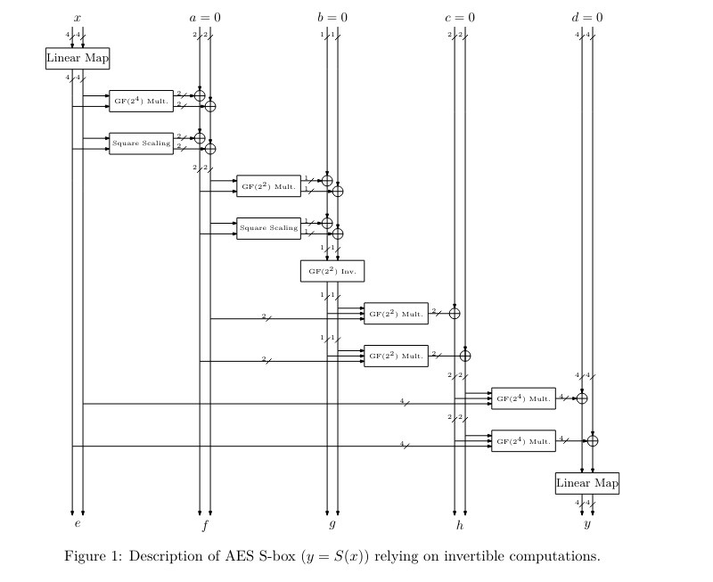
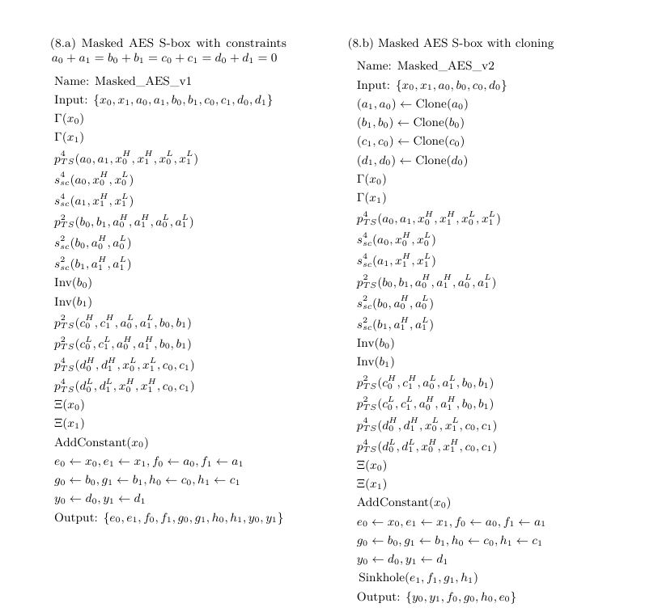

# Securing AES against SCA and SIFA

# Overview
This file is being used to document the development of AES sbox based on J. Daemen, et al., "Protecting against Statistical Ineffective Fault Attacks" [link to the paper](https://eprint.iacr.org/2019/536.pdf).

## Files 
This section will keep  track of the files added for acheiveing the below features and functionaly.
File list:
1. opentitan/hw/ip/aes/rtl/aes_sbox_toffoli_masked.sv
2. opentitan/hw/ip/aes/rtl/aes_sbox_toffoli_pkg.sv

## Features

Currently the following features of AES sbox based the J. Daemen work are implmented:
1. use of toffoli gate as basic circuit unit
2. Canright's description of AES S-box using Toffoli gate (masked version is implemented ref. figure 1, page 12 and circuit 8.a, 8.b, page 14 of the paper)
3. AES S-box forward (S-box for encryption)

The implmentation of following features of AES sbox based the J. Daemen work are in progress:

1. AES S-box Reverse (S-box with support for decryption)
2. linear check sum for  comparsion in redundant computation (as described in section 4, page 15 of the paper ) 
3. Integration of Daemen's AES Sbox implementation in the AES core of Opentitan. 

## Verification Plan

The functional Verification of the block can be done by already existing verification frameworks and tests of opentitan, by integrating block into the opetitan's aes core.

The Security hardening of the core aganist SCA will be verified by the following tests: 
1. MaskVerif: for verification of maskig scheme (also used by the author [link](https://cryptoexperts.com/maskverif/)) 
2. CocoAlma: for verification of masking scheme, already used by opentian for other implmentation
3. VerMiVer: for verification of masking scheme. [link](https://github.com/vmarribas/VerMFi)

The Security hardening of the core aganist SIFA will be verified by the following tests:
1. VerFI: for verification aganist fault injections

## Appendix 

### A. AES Sbox Description relying on Invertible computations. 

### B. Masked AES S-box Circuit

## Reference
All the images and ciruits description is taken from the the paper J. Daemen, et al., "Protecting against Statistical Ineffective Fault Attacks" [link to the paper](https://eprint.iacr.org/2019/536.pdf).

